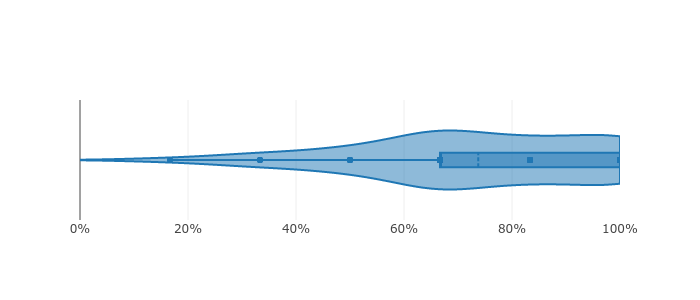
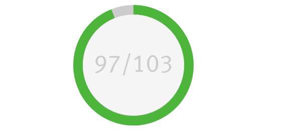
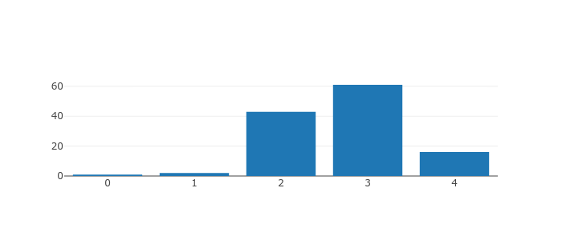

# report_scorm
## General Warning
SCORM is in general extremley restrictive with what information it passes to a LMS like Moodle.
In addition, standards vary not only between versions but different editors have competing standards aswell.
Because of this some functionality like extracting a questions title may be unavailable.
In extreme cases (for example if the id field of questions is renamed) the plugin might even not work at all.  
Below you can find a table of editor and version combinations that have been tested.
Please note that this is merely an indicator as your SCORM packets configurations might be different from those tested.

| Editor      | SCORM version | Restrictions |
|-------------|---------------|--------------|
| Ispring     | TBD           | -            |
| Articulate  | TBD           | -            |

## Purpose
This plugin is adding a new report type to SCORM packets,
focussing on evaluating individual questions.  
Every question's results are visualized based on what kind of question it is.
There are 4 basic question types.  

- Scored questions where an answer can lie on a spectrum of "correctnes" are visualized using a violin-plot. Classical example of this would be a multiple-choice-question 
- Scored questions where an answer is either right or wrong are visualized by showing the amount of total and correct answers
- Unscored questions that has only numerical answers like i.E. a likert-scala will be visualized with a bar diagramm
- Unscored questions that have a range of answers will have their answers displayed in a table

## Installation

To install this plugin clone this repository into `moodleroot/mod/scorm/report/question`

## Technical Details
###### A quick notice on SCORM SCO terminology

Not all scos are the same there may also be 'informational' scos that do not contain any "lesson information" instead they hold metadata of the creating organization etc.
While these 'scos' are found in the scorm->sco reference table and their id is returned when querying for scos belonging to a scorm packet they do not represent a 'real' scorm packet.  
So while these are found in the sco table for an sco to hold any information about lessons it needs to have its type set to 'sco'.

### Understanding the flow of this plugin
To understand the flow of this Plugin it is recommended to start in the classes/report.php file. 
Here you can find the display function that is invoked by Moodle.

The high-level flow is:  
Initially we get the scormid from moodle. We then fetch the associated SCOIDs from the database.
For each sco we then retrieve all track data from the database,
this data is structured in the cmi-dot-notation meaning we get a big array with "cmi.path.to.resource":"value".
from this large unstructured array we build the corrosponding structure as arrays and subarrays ($array['path']['to]['resource]=value).
The corrosponding data structure will be structured by attempt made by a student. We restructure this to instead reflect what attempts were made for a question.
We then add some statistical data like percentage correct.  
This is now passed to the javascript where we try to group questions, extract some info like the questiontext and finally choose what visualizations type to use for this question and append its visualization to the DOM.
